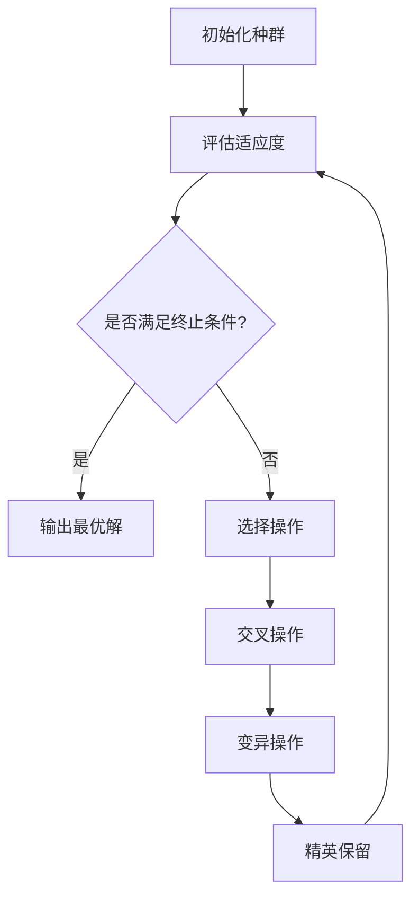

# TSP-Visualization
### 旅行商问题遗传算法可视化

一个基于遗传算法解决旅行商问题（TSP）的交互式可视化工具，使用 React + TypeScript 构建，实时展示算法进化过程和求解结果。


##  项目概述

旅行商问题（Traveling Salesman Problem, TSP）是一个经典的组合优化问题：给定一系列城市和每对城市之间的距离，求解访问每一座城市一次并回到起始城市的最短回路。

本项目实现了：
- **🧬 完整的遗传算法**：解决 TSP 问题
- **🎨 实时可视化**：展示算法进化过程
- **⚙️ 交互式参数调节**：动态调整算法参数
- **📊 性能监控**：实时显示算法性能指标

##  项目结构

```
TSP-Visualization/
├── src/
│   ├── App.tsx              # 应用根组件
│   ├── main.tsx             # 应用入口
│   ├── TSPGeneticAlgorithm.tsx  # 核心算法组件
│   ├── styles/
│   │   ├── App.css          # 全局样式
│   │   ├── index.css        # 样式重置
│   │   └── TSPStyles.css    # TSP 组件样式
│   └── types/
│       └── index.ts         # TypeScript 类型定义
├── index.html               # HTML 模板
├── package.json             # 项目配置
├── tsconfig.json            # TypeScript 配置
├── vite.config.ts           # Vite 配置
└── README.md               # 项目说明
```

##  快速开始

### 环境要求

- Node.js 16.x 或更高版本
- npm 或 yarn 包管理器

### 安装步骤

1. **克隆项目**
```bash
git clone https://github.com/yangling-happy/TSP-Visualization.git
cd TSP-Visualization
```

2. **安装依赖**
```bash
npm install
# 或
yarn install
```

3. **启动开发服务器**
```bash
npm run dev
# 或
yarn dev
```

4. **打开浏览器**
访问 `http://localhost:5173`（或终端显示的地址）

##  使用说明


### 操作步骤

1. **初始化城市**：
   - 点击"随机生成城市"按钮创建随机分布的城市
   - 或在画布上点击添加自定义城市位置

2. **配置算法参数**：
   - 调整种群大小、变异率等参数
   - 参数说明见下方"算法参数"部分

3. **运行算法**：
   - 点击"开始计算"按钮启动遗传算法
   - 观察实时更新的最优路径

4. **控制与监控**：
   - 使用"暂停/继续"控制算法运行
   - 点击"重置"重新开始
   - 查看右侧统计面板了解算法状态

##  算法详解

### 遗传算法流程



### 核心组件实现

#### 1. 个体表示

```typescript
interface City {
  id: number;     // 城市ID
  x: number;      // X坐标
  y: number;      // Y坐标
}

interface Individual {
  path: City[];    // 访问顺序（染色体）
  fitness: number; // 适应度值
  length: number;  // 路径总长度
}
```

#### 2. 适应度函数

适应度定义为路径长度的倒数，确保路径越短的个体适应度越高：

```typescript
const calculateFitness = (individual: Individual): number => {
  // 路径长度 = ∑距离(city_i, city_i+1)
  const length = calculatePathLength(individual.path);
  return 1 / length; // 路径越短，适应度越高
};
```

#### 3. 选择算子（轮盘赌选择）

```typescript
const rouletteWheelSelection = (population: Individual[]): Individual => {
  const totalFitness = population.reduce((sum, ind) => sum + ind.fitness, 0);
  let random = Math.random() * totalFitness;
  
  for (const ind of population) {
    random -= ind.fitness;
    if (random <= 0) return ind;
  }
  return population[population.length - 1];
};
```

#### 4. 交叉算子（顺序交叉 OX）

确保后代包含所有城市且不重复：

```typescript
const orderCrossover = (parent1: City[], parent2: City[]): City[] => {
  const size = parent1.length;
  const start = Math.floor(Math.random() * size);
  const end = (start + Math.floor(Math.random() * (size - start))) % size;
  
  const child = new Array(size).fill(null);
  
  // 复制父代1的片段
  for (let i = start; i !== end; i = (i + 1) % size) {
    child[i] = parent1[i];
  }
  
  // 从父代2填充剩余位置
  let pointer = end;
  for (const city of parent2) {
    if (!child.includes(city)) {
      child[pointer] = city;
      pointer = (pointer + 1) % size;
    }
  }
  
  return child;
};
```

#### 5. 变异算子（交换变异）

```typescript
const swapMutation = (path: City[]): City[] => {
  const newPath = [...path];
  if (Math.random() < mutationRate) {
    const i = Math.floor(Math.random() * newPath.length);
    const j = Math.floor(Math.random() * newPath.length);
    [newPath[i], newPath[j]] = [newPath[j], newPath[i]];
  }
  return newPath;
};
```

#### 6. 精英保留策略

每代保留最优个体，防止优秀基因丢失：

```typescript
const preserveElite = (population: Individual[], eliteCount: number): Individual[] => {
  const sorted = [...population].sort((a, b) => b.fitness - a.fitness);
  return sorted.slice(0, eliteCount);
};
```

### 算法参数说明

| 参数 | 默认值 | 范围 | 说明 |
|------|--------|------|------|
| **城市数量** | 20 | 5-50 | 问题的规模，城市越多求解难度越大 |
| **种群大小** | 100 | 20-200 | 每代个体数量，影响搜索多样性 |
| **变异率** | 0.01 | 0-0.1 | 个体发生变异的概率 |
| **交叉率** | 0.8 | 0.5-1.0 | 个体进行交叉的概率 |
| **最大代数** | 1000 | 100-5000 | 算法最大迭代次数 |
| **精英数量** | 2 | 1-5 | 直接保留到下一代的优秀个体数 |


##  功能特性

### 可视化功能
- **实时路径绘制**：灰色线显示当前最优，红色线显示全局最优
- **城市交互**：支持点击添加/删除城市
- **动画效果**：平滑的路径更新动画
- **多视图支持**：可切换不同显示模式

### 算法功能
- **参数实时调节**：运行中可动态调整算法参数
- **进度监控**：显示当前代数、最优路径长度
- **性能统计**：记录算法运行时间和收敛情况
- **多种终止条件**：支持按代数或收敛程度终止

### 交互功能
- **播放控制**：开始、暂停、重置
- **数据导出**：支持导出最优路径数据
- **历史记录**：保存多次运行结果对比
- **响应式设计**：适配不同屏幕尺寸

## 开发指南

### 项目构建
```bash
# 开发模式
npm run dev

# 生产构建
npm run build

# 预览生产版本
npm run preview

# 代码检查
npm run lint
```

### 添加新功能
1. **扩展算法**：在 `TSPGeneticAlgorithm.tsx` 中添加新的遗传算子
2. **添加可视化**：扩展 `drawPath` 和 `drawCities` 方法
3. **修改样式**：更新对应的 CSS 文件

### 代码规范
- 使用 TypeScript 严格模式
- 遵循 React Hooks 最佳实践
- 组件采用函数式组件
- 重要函数添加 JSDoc 注释

## 性能优化建议

1. **大数据量优化**：
   - 启用 Web Worker 进行后台计算
   - 使用 Canvas 替代 SVG 进行渲染
   - 实现增量式路径更新

2. **算法改进**：
   - 添加局部搜索（2-opt, 3-opt）
   - 实现自适应参数调整
   - 支持多种选择策略（锦标赛选择等）

3. **用户体验**：
   - 添加进度条和预估时间
   - 实现结果对比功能
   - 添加预设问题库


##   许可证

本项目采用 MIT 许可证 

##  学习资源

- [遗传算法维基百科](https://zh.wikipedia.org/wiki/遗传算法)
- [TSP问题介绍](https://en.wikipedia.org/wiki/Travelling_salesman_problem)
- [React官方文档](https://reactjs.org/docs/getting-started.html)
- [TypeScript手册](https://www.typescriptlang.org/docs/)

## 🐛 发现问题？

本项目用于个人学习，存在很多不足。       

欢迎在 [Issues](https://github.com/yangling-happy/TSP-Visualization/issues) 中反馈。
